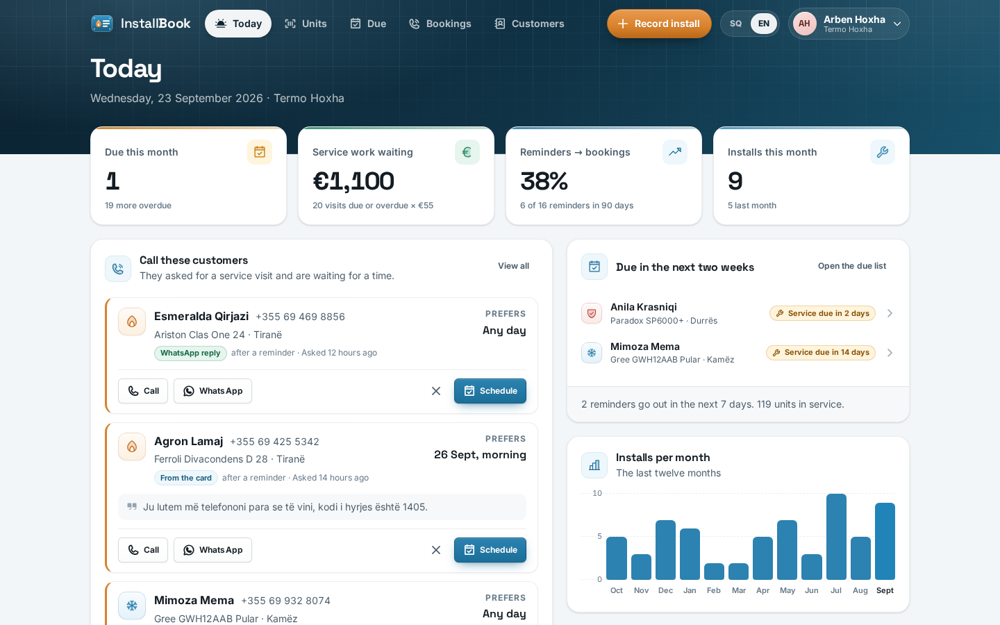
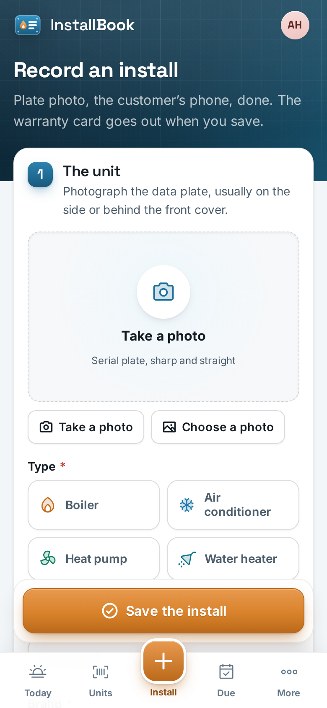
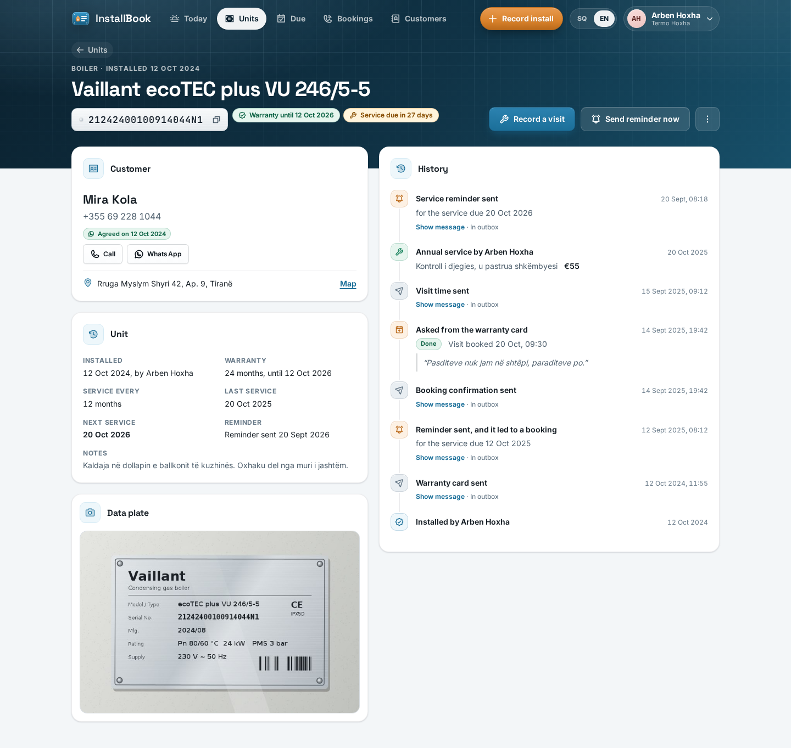
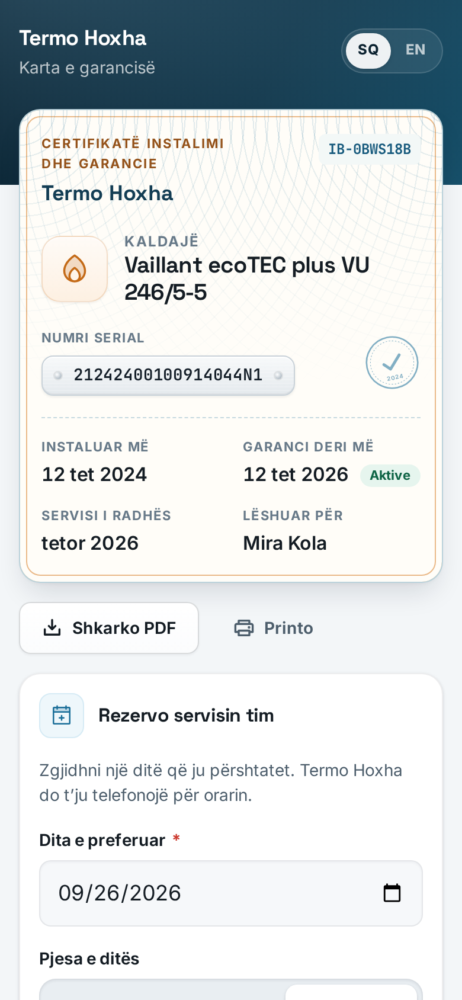
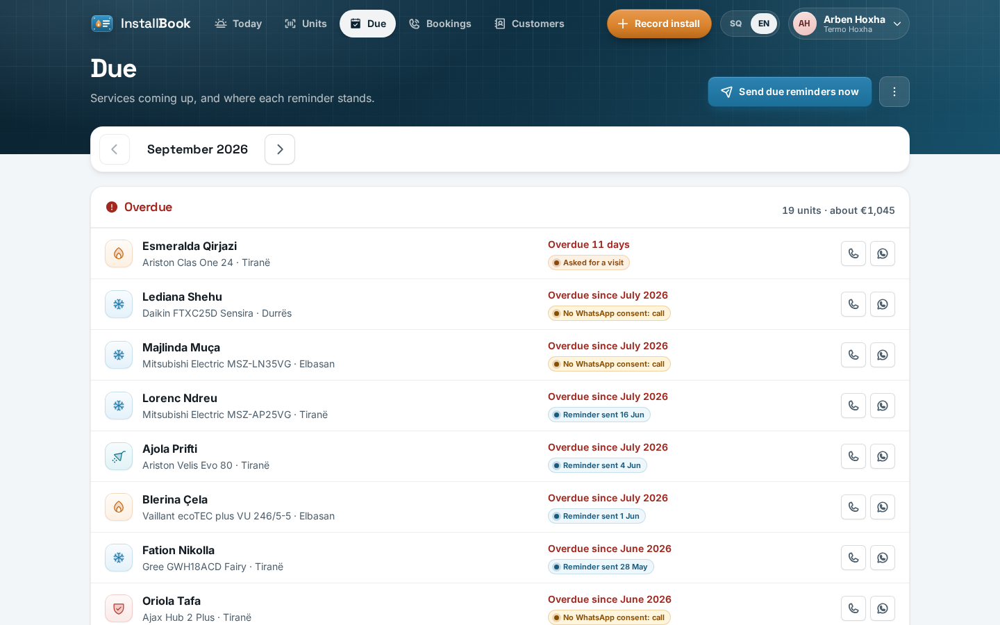
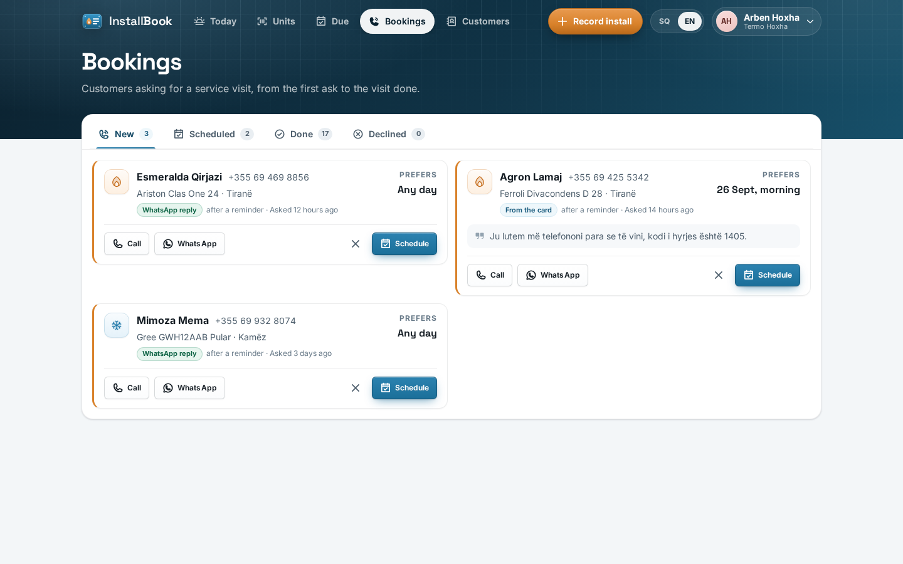
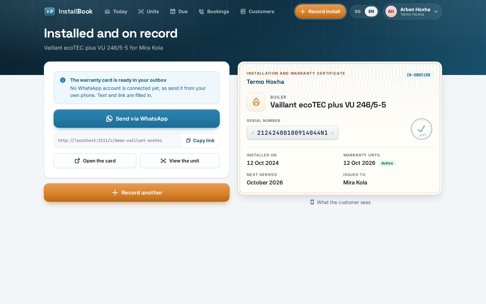

# InstallBook

The installer's own register of every unit he has fitted. Photograph the serial plate, the customer gets a WhatsApp warranty card they cannot lose, and at month eleven both of you get the service reminder, with a one-tap booking.

<p>
  
  &nbsp;
  
</p>

## Why

An installer fits 100 to 300 boilers, air conditioners, water heaters, heat pumps, inverters or alarm panels a year. Each one needs an annual service (45 minutes, EUR 40 to 80, his best-paid work) and carries a two-to-five-year warranty tied to a serial number. He keeps no list: the serial is on a plate behind the unit, the warranty card is paper the customer loses, and the "service due" date exists nowhere. He ends up doing about one in ten of the services he could, and warranty claims turn into arguments because nobody can prove the install date or which unit went where. His unit of work is a machine at an address, not a person, which is why CRMs that start from a typed customer never get filled in.

## What it does

- **Record an install in one screen**, phone first: plate photo, "Read the plate" (Claude reads type, brand, model and serial, and says what to double-check), manual entry that always works, brand suggestions from past installs, the customer found by phone (a returning customer is filled in, with their other units), "Use my location" for the address, an explicit WhatsApp consent tick, warranty chips (2, 3, 5 years or months), service interval, and a live "warranty until / first service" preview.
- **Warranty card on WhatsApp.** Saving sends the card to customers who agreed, in their language. Without consent, or without a WhatsApp account connected, the same text is one tap away as a `wa.me` link from the installer's own phone.
- **The customer's card**, a public page from the link: installer and phone (call, WhatsApp), unit, serial, install date, warranty until (active or ended), last and next service, full service history, **Book my service** (preferred day, morning or afternoon, a note), print styles, and a **one-page PDF certificate**.
- **Service reminders that go out on their own**, at 08:00 in the installer's time zone, lead days before each unit's due date (30 by default), once per unit per service cycle. Customers who answer **1 / po / yes / book / rezervo** become booking requests with a thank-you reply; **stop / ndalo** withdraws consent and confirms it.
- **Today**: requests waiting for a call (call, WhatsApp, schedule), services due this month and overdue, service work waiting (visits x typical price), how many reminders turned into bookings in 90 days, installs this month and over twelve months.
- **Due list** by month (overdue, this month, next month) with where each reminder stands: planned for a date, sent, no consent (call instead), booking requested, visit booked. "Send due reminders now" runs the same job on demand, and the Monday digest can be sent to the business phone.
- **Bookings** from new to scheduled (the time is sent to the customer) to done (which records the service visit and moves the next due date) or declined (with an optional polite note).
- **Units register** searchable by serial, name, phone, address or brand, filtered by type, warranty and service state; **unit page** with the plate photo, map link, status pills and a full history of installs, visits, reminders, bookings, messages and replies.
- **Customers** with their units, WhatsApp consent (dated, and switched on only after confirming the customer said yes) and the whole conversation.
- **Settings**: default warranty and service interval, reminder lead days, typical service price, the phone shown to customers, plus profile, business and team. Technicians record installs and visits; settings, team and the reminder run stay with the installer.
- English and Albanian throughout, including every customer message, sent in the customer's own language.

<p>
  
  &nbsp;
  
</p>

<p>
  
  
</p>

<p></p>

## How it works

**Dates.** The warranty runs to the anniversary of the install, inclusive: 24 months from 12 Oct 2025 covers up to 12 Oct 2027. Months are calendar months; when the target month is shorter the date falls on its last day (31 Jan + 1 month is 28 or 29 Feb, a leap-day install is covered to 28 Feb in common years). The next service is counted from the latest real event, the install or the last annual service or inspection, so an early or a late visit restarts the cycle instead of letting it drift. Repairs and warranty call-outs are recorded but do not reset the cycle. Warranty end and next due date are stored on the unit, so the register sorts and filters in SQL, and recomputed whenever their inputs change.

**Reminders.** A reminder belongs to a unit and a due date, and that pair is unique in the database. The daily run looks at units due within the lead window and asks one pure rule what to do: nothing before the window opens; nothing if the customer already asked for a visit; nothing if this cycle was already handled (sent, failed, booked or serviced); without WhatsApp consent it records the cycle once as "call instead", and sends only if the customer opts in before the cycle ends. So running the job twice, or pressing "Send due reminders now" after the 08:00 run, sends nothing new. Runs for one installer never overlap (a Postgres advisory lock), and the scheduler checks every ten minutes whether it is past 08:00 in the installer's own time zone, so a restart or a server in another zone still gets the day right. The wording is honest: "due for its regular service in October", or for a past month "there is no rush, but a check keeps it safe" and never a fake warranty threat. Every reminder ends with how to stop them.

**Bookings and conversion.** A booking request from the card or a WhatsApp reply is linked to that cycle's reminder when it followed one. Reminders to bookings is the share of reminders sent in the last 90 days that led to a booking. A unit has at most one open request: asking twice returns the first.

**Replies.** An inbound message is matched to the organisation that last wrote to that phone. A short answer (1, po, yes, book, rezervo) books the unit of the reminder they are answering (or their unit due soonest); stop or ndalo withdraws consent and confirms it. Anything else stays in Messages for a person to read.

**Plate reading.** The photo is stored first, whatever happens next: it is the proof of which unit went where. With an API key, Claude returns `{type, brand, model, serialNumber, notes}` under an instruction to read only what is printed, return null for anything unreadable and never complete serial characters. Blank, "unknown" and "N/A" answers are cleaned to null, and the form shows a "check these against the plate" notice.

**The public card** is reached by an unguessable token and shows only what the customer needs: no internal ids, no other customers, not even their own phone number. The short card number printed on it is derived from the token, not from database ids.

## Stack

- Backend: Java 17, Spring Boot 4.1 (Web MVC, Data JPA, Security with session cookies and CSRF, Validation), PostgreSQL with Flyway, Spring Session JDBC, OpenPDF 2.0 for the certificate, the Anthropic Java SDK for plate reading, the WhatsApp Cloud API for messages.
- Frontend: Vue 3.5, TypeScript, Vite, Vue Router, Pinia, vue-i18n, Phosphor icons, Space Grotesk, Inter and JetBrains Mono; installable as a PWA.
- Tests: JUnit 5 with MockMvc against a real PostgreSQL database; Vitest.

## Run it locally

You need Java 17 (the Maven wrapper is included), Node 22 and PostgreSQL 14 or newer.

```bash
# 1. Databases (the tests use their own)
createuser installbook --pwprompt          # password: installbook
createdb -O installbook installbook
createdb -O installbook installbook_test

# 2. Backend on :8111 (creates the schema and, in demo mode, a sample installer)
cd backend
./mvnw spring-boot:run

# 3. Frontend on :5111, proxying /api to the backend
cd frontend
npm install
PORT=5111 BACKEND_URL=http://localhost:8111 npm run dev
```

Open http://localhost:5111 and sign in as the demo installer, **demo@installbook.test / demo1234** (Arben Hoxha, Termo Hoxha, Tirana: about 120 units over 30 months, services, reminders, open requests, some units overdue, and generated plate photos). A technician account is **tech@installbook.test / demo1234**. The showcase warranty card is at http://localhost:5111/c/demo-vaillant-ecotec. In demo mode the Messages page has a reply simulator: answer 1, PO or STOP as a customer who got a reminder.

For production, build the frontend (`npm run build`) and serve `frontend/dist` from the backend's `static` folder or any web server that proxies `/api`.

## Configuration

All settings are environment variables with safe local defaults.

| Variable | Default | What it does |
| --- | --- | --- |
| `DB_URL`, `DB_USER`, `DB_PASSWORD` | local `installbook` database | PostgreSQL connection |
| `PORT` | `8111` | Backend port |
| `APP_PUBLIC_URL` | `http://localhost:5111` | Base of the links sent to customers (warranty cards) |
| `APP_SECRET` | dev value | Signs the short-lived links to plate photos on public cards; set it in production |
| `APP_DEMO` | `true` | Seeds the demo installer on an empty database and enables the reply simulator |
| `APP_JOBS` | `true` | The 08:00 reminder run and the Monday digest |
| `APP_STORAGE_DIR` | `./storage` | Where plate photos are kept |
| `MESSAGING_DRIVER` | `log` | `whatsapp` sends through the WhatsApp Cloud API |
| `WHATSAPP_TOKEN`, `WHATSAPP_PHONE_NUMBER_ID` | empty | WhatsApp Cloud API credentials |
| `WHATSAPP_APP_SECRET`, `WHATSAPP_VERIFY_TOKEN` | empty | Webhook signature check and verification for incoming replies (`/api/webhooks/whatsapp`) |
| `ANTHROPIC_API_KEY` | empty | Enables "Read the plate" |
| `ANTHROPIC_MODEL` | `claude-opus-5` | Model used for plate reading |
| `APP_GEO_NOMINATIM_URL` | `https://nominatim.openstreetmap.org` | Reverse geocoding for "Use my location" |

**Without WhatsApp configured** every message is still written, stored and shown under Messages as "In outbox", with an "Open in WhatsApp" button that opens the same text in the installer's own WhatsApp. Warranty cards and reminders reach customers who did not agree to messages only this way, by hand. Messages the business starts outside WhatsApp's 24-hour window need approved templates: map each key (`warranty_card`, `service_due`, `service_overdue`, `booking_received`, `booking_scheduled`, `booking_declined`, `installer_digest`, `opt_out_confirmed`) to your template as `app.messaging.whatsapp.templates.<key>=<template name>|<param>,<param>`; unmapped keys are sent as text.

**Without an Anthropic key** the plate photo is stored and the installer types the details; the form says so. **If reverse geocoding fails** the coordinates are still saved and the address stays editable.

## Tests

```bash
cd backend && ./mvnw verify      # 72 tests
cd frontend && npm run type-check && npm test && npm run build-only   # 19 tests
```

The backend suite covers the date arithmetic (month ends, leap years, early and late services), the reminder rules and the run itself (lead days, running twice, consent given later, customers who already asked), replies turning into bookings and stop withdrawing consent, visits moving the next due date, the booking lifecycle, tenant isolation on units, customers, bookings and photos, the public card (fields, no leaks, one open request, the PDF), and the plate endpoint without an AI key. The frontend tests cover the date and formatting logic, including Albanian formatting without ICU data.

## Project structure

```
backend/src/main/java/io/github/andis382/installbook/
  units/       units, the date schedule, register search, unit page and history
  customers/   customers found by phone, consent
  visits/      service visits and what restarts the cycle
  reminders/   reminder rule, idempotent run, daily scheduler, Monday digest
  bookings/    booking requests, their lifecycle, WhatsApp reply handling
  cards/       public warranty card and PDF certificate
  due/         the due list
  dashboard/   the Today numbers
  notify/      every customer message, with consent and language
  ai/          plate reading
  geo/         reverse geocoding
  settings/    installer settings
  demo/        demo seeder, catalogue and generated plate photos
  auth, common, config, files, messaging   (from the kit: sessions, errors, files, outbox)
backend/src/main/resources/db/migration     Flyway migrations
frontend/src/
  views/        Today, Install, Units, Unit, Due, Bookings, Customers, public card, Settings, Messages
  components/   units/, bookings/, layout/, ui/
  lib/          API client, date arithmetic, formatting, unit helpers
  i18n/         en.ts, sq.ts
```

## License

MIT, see [LICENSE](LICENSE).
